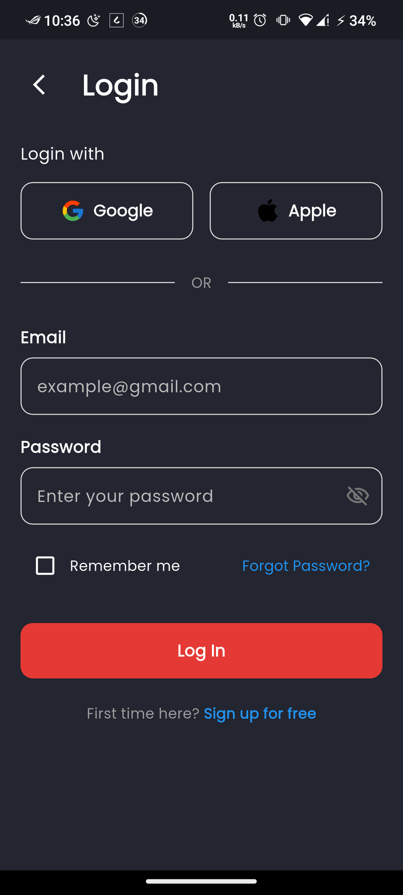
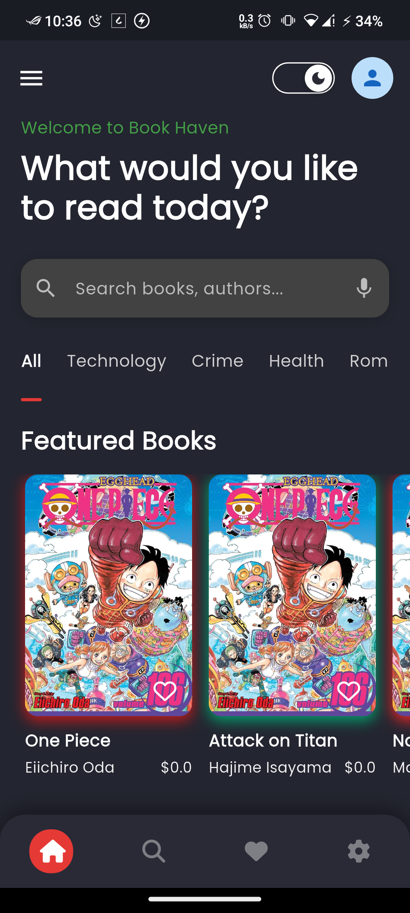
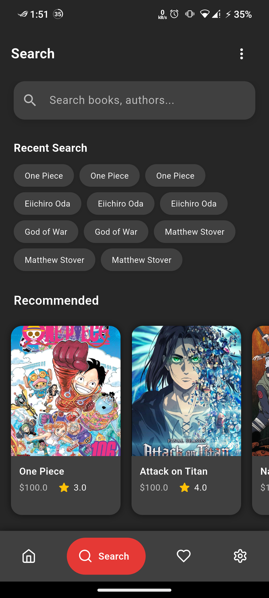

# flipshelf

A new Flutter project.

## Getting Started

This project is a part of my OJT(On-the-Job Training).

### TODO
[ ] Add Search page

[ ] Add Favorite page

[ ] Add Settings  

## Screenshot

