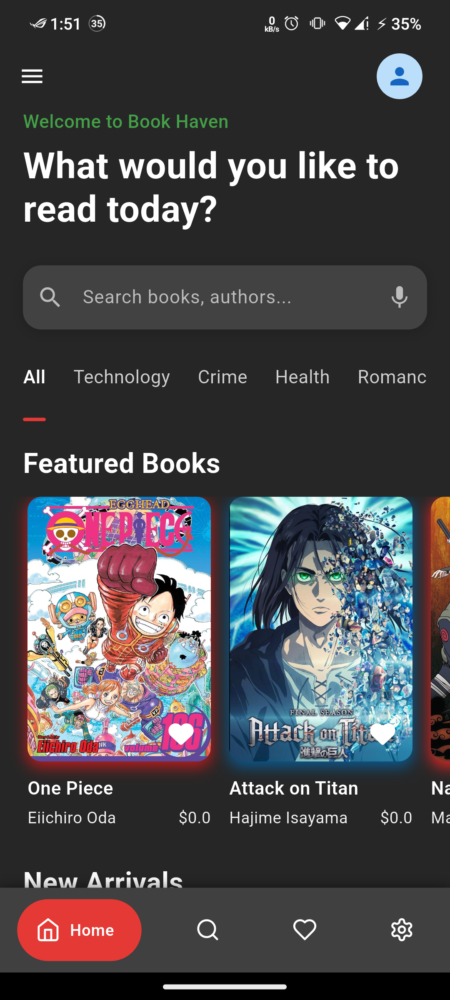

# flipshelf

A new Flutter project.

## Getting Started

This project is a part of my OJT(On-the-Job Training).

### TODO
[x] Add Search page

[x] Add Favorite page

[x] Add Settings  

[ ] Add books from api

## Screenshot

